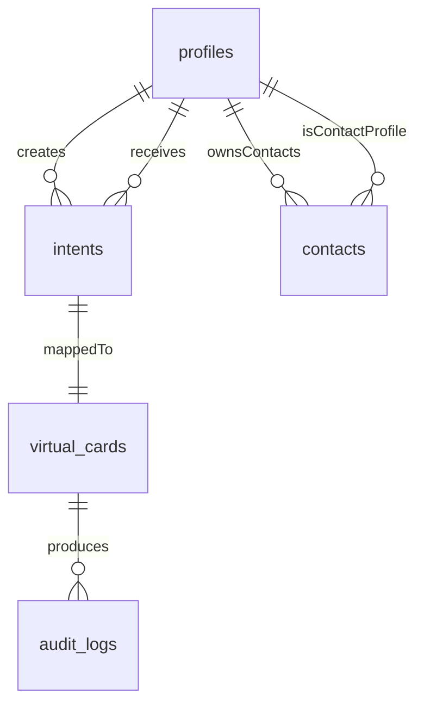

# IntPay Database Documentation

## 1) Schema Overview

The IntPay database schema models a controlled spending system for virtual payment cards.  
It separates wallet liquidity from reserved allocations, binds each spending intent to one virtual card, and captures all authorization outcomes in an immutable audit trail.

Core business goals covered by this schema:
- Keep user funds explicit between **available** and **reserved** balances.
- Enforce programmable spending constraints (amount, usage count, geography, website rules).
- Maintain end-to-end traceability for every card transaction attempt.

## 2) Entity-Relationship Diagram

Relationship notes:
- `profiles` -> `intents` appears twice: `creator_id` and `receiver_id`.
- `contacts` is a self-referential many-to-many bridge over `profiles`.
- `intents` -> `virtual_cards` is one-to-one by `virtual_cards.intent_id UNIQUE`.
- `virtual_cards` -> `audit_logs` is one-to-many by `audit_logs.card_id`.

## 3) Table Purpose in IntPay

### `profiles`
Represents wallet owners and their account-level balances. It is the monetary anchor for all intent funding and reservation behavior.

### `contacts`
Represents saved user-to-user relationships so one profile can quickly target another profile as a transfer/spending recipient.

### `intents`
Represents the spending contract (policy + budget) that defines how a virtual card can be used.

### `virtual_cards`
Represents the physical/processor-facing card object (Stripe card identity and card display metadata) linked to exactly one intent.

### `audit_logs`
Represents immutable event history of transaction attempts and decisions, used for dispute analysis, controls verification, and simulation/replay.

## 4) Field Definitions and Business Logic

## `profiles`

| Field | Type | Constraints / Default | Business Meaning |
|---|---|---|---|
| `id` | `serial` | PK | Integer profile identifier used across API and FK references. |
| `name` | `text` | `NOT NULL` | User full name shown in app workflows. |
| `username` | `text` | `UNIQUE NOT NULL` | Stable public lookup/mention key. |
| `email` | `text` | `UNIQUE NOT NULL` | Contact and account communication identity. |
| `vault_balance` | `numeric(12,2)` | `NOT NULL DEFAULT 0 CHECK >= 0` | **Available cash**: funds immediately allocable to new intents/cards. |
| `lock_money` | `numeric(12,2)` | `NOT NULL DEFAULT 0 CHECK >= 0` | **Reserved cash**: funds already allocated to active intents and unavailable for new allocations. |
| `stripe_customer_id` | `text` | nullable | External processor customer mapping. |
| `created_at` | `timestamptz` | `NOT NULL DEFAULT now()` | Profile creation timestamp. |

### Balance Model: `vault_balance` vs `lock_money`
- `vault_balance` is free liquidity that can fund new intent creation.
- `lock_money` is capital ring-fenced for active virtual card programs.
- At intent creation, funds move from `vault_balance` to `lock_money`; this prevents double spending against unfunded intent budgets.

## `contacts`

| Field | Type | Constraints / Default | Business Meaning |
|---|---|---|---|
| `user_id` | `int` | FK -> `profiles.id`, part of PK | The owner profile maintaining the contact list. |
| `contact_id` | `int` | FK -> `profiles.id`, part of PK | Another profile saved as a contact. |

Self-reference logic:
- This table implements a many-to-many self-reference over `profiles`.
- Composite PK (`user_id`, `contact_id`) prevents duplicate contact entries for the same owner pair.

## `intents`

| Field | Type | Constraints / Default | Business Meaning |
|---|---|---|---|
| `id` | `serial` | PK | Integer intent identifier. |
| `creator_id` | `int` | `NOT NULL`, FK -> `profiles.id` | Account funding the intent and bearing allocation cost. |
| `receiver_id` | `int` | `NOT NULL`, FK -> `profiles.id` | Intended card recipient (can equal creator). |
| `amount` | `numeric(12,2)` | `NOT NULL CHECK > 0` | Original funded budget of the intent at creation. |
| `remaining_amount` | `numeric(12,2)` | `NOT NULL CHECK >= 0` | Remaining spendable budget after successful settlements. |
| `use_times` | `int` | `NOT NULL DEFAULT 1` | Total allowed successful uses configured initially. |
| `uses_left` | `int` | `NOT NULL DEFAULT 1` | Remaining successful uses after completed authorizations. |
| `expiry_at` | `timestamptz` | nullable | Hard expiration for card usage eligibility. |
| `country` | `text` | nullable | Optional country allow-rule. |
| `city` | `text` | nullable | Optional city allow-rule. |
| `lock_for_websites` | `boolean` | `DEFAULT false` | E-commerce gate flag controlling online transaction permissibility. |
| `only_websites` | `jsonb` | `DEFAULT '[]'::jsonb` | Domain/merchant whitelist used to allow only listed web destinations. |
| `required_prove` | `boolean` | `DEFAULT false` | Requires post-payment proof artifact in downstream workflow. |
| `description` | `text` | nullable | Human-readable purpose label for the spending intent. |
| `status` | `intent_status` | `NOT NULL DEFAULT 'active'` | Lifecycle state (`pending`, `active`, `expired`). |
| `created_at` | `timestamptz` | `NOT NULL DEFAULT now()` | Intent creation timestamp. |

### Spending Control Logic
- `amount` vs `remaining_amount`:
  - `amount` is the immutable original budget.
  - `remaining_amount` is the live budget counter used in authorization checks.
- `use_times` vs `uses_left`:
  - `use_times` is the initial successful-use cap.
  - `uses_left` decrements after each successful settlement.
- Intent should move to `expired` once budget reaches zero, uses are exhausted, or expiration time passes.

### Website Restriction Logic
- `lock_for_websites = true` means online/e-commerce authorizations are blocked.
- `only_websites` provides explicit allow-listing:
  - Empty list means no domain-level allowance restrictions are configured.
  - Non-empty list means authorization should approve only if the transaction website/domain matches one listed entry.
- Combined behavior is typically evaluated before monetary settlement.

## `virtual_cards`

| Field | Type | Constraints / Default | Business Meaning |
|---|---|---|---|
| `id` | `serial` | PK | Integer virtual card identifier. |
| `stripe_card_id` | `text` | `UNIQUE NOT NULL` | Processor-side card identity (`ic_...`). |
| `intent_id` | `int` | `UNIQUE NOT NULL`, FK -> `intents.id` | Enforces one-to-one mapping between card and intent policy. |
| `card_number` | `text` | nullable | Full PAN value for controlled display/use flows. |
| `last4` | `text` | nullable | Masked display suffix for UI. |
| `cardholder_name` | `text` | nullable | Name rendered on card details. |
| `exp_month` | `int` | nullable | Card expiration month. |
| `exp_year` | `int` | nullable | Card expiration year. |
| `status` | `text` | `NOT NULL DEFAULT 'active'` | Operational card status for runtime checks. |
| `created_at` | `timestamptz` | `NOT NULL DEFAULT now()` | Card provisioning timestamp. |

## `audit_logs`

| Field | Type | Constraints / Default | Business Meaning |
|---|---|---|---|
| `id` | `serial` | PK | Integer audit event identifier. |
| `card_id` | `int` | `NOT NULL`, FK -> `virtual_cards.id` | Card that initiated the authorization attempt. |
| `transaction_amount` | `numeric(12,2)` | `NOT NULL CHECK >= 0` | Attempted transaction amount. |
| `merchant_name` | `text` | nullable | Merchant label from authorization payload. |
| `mcc` | `text` | nullable | Merchant category code used for policy checks/reporting. |
| `city` | `text` | nullable | Merchant location as observed at authorization time. |
| `decision` | `decision_status` | `NOT NULL` | Final authorization result (`approved` or `declined`). |
| `reason` | `text` | nullable | Decline reason or explanation for operational review. |
| `created_at` | `timestamptz` | `NOT NULL DEFAULT now()` | Event timestamp for timeline reconstruction. |

## 5) Transaction Lifecycle

### A) Creation (Funding + Card Provisioning)
1. User creates an intent with budget (`amount`) and usage controls (`use_times`).
2. System applies a fixed `0.05` creation fee.
3. Wallet movement occurs:
   - Deduct allocated money from `profiles.vault_balance`.
   - Add allocated money to `profiles.lock_money`.
4. Initialize counters:
   - `remaining_amount = amount`
   - `uses_left = use_times`
5. Provision a `virtual_cards` record bound to the new `intents.id`.

### B) Authorization (Rule Evaluation)
1. Incoming transaction identifies a card (e.g., via `card_number`).
2. Resolve card -> intent context:
   - `virtual_cards` lookup
   - linked `intents` policy
3. Validate controls before approval:
   - Card/intent status active and not expired (`expiry_at`).
   - Amount rule (`transaction_amount <= remaining_amount`).
   - Usage rule (`uses_left > 0`).
   - Geographic restrictions (`country`, `city`) if configured.
   - Merchant/control checks (e.g., MCC or city policy logic from payload).
   - Website logic (`lock_for_websites`, `only_websites`).
4. Persist outcome in `audit_logs` as `approved` or `declined` with reason.

### C) Settlement (State Mutation After Success)
On approved and settled transactions:
1. Decrement `remaining_amount` by settled amount.
2. Decrement `uses_left` by one.
3. If `remaining_amount = 0` or `uses_left = 0`, mark intent/card as no longer active (typically `expired` intent state).
4. Keep full traceability through `audit_logs`.

## 6) Technical Note on ID Strategy

All primary IDs in this schema are Integer-based (`serial`) to align with API integration requirements and simplify client/backend contract handling, including request/response payloads and foreign-key passing across service boundaries.
