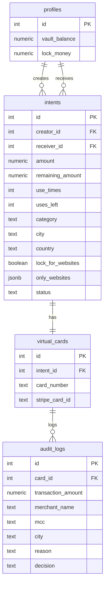
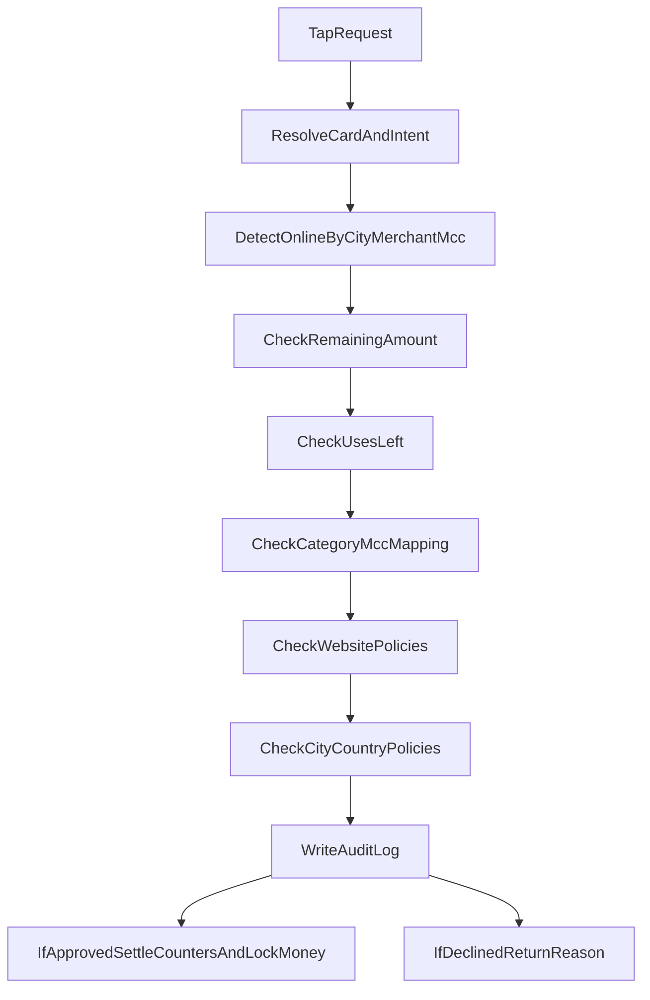

# IntPay Backend

## Project Overview

IntPay Backend is a **Fintech intent-based payment system** built around programmable spending controls.
Each payment intent defines who can spend, how much can be spent, where/when it can be spent, and (optionally) which MCC categories are allowed.  
The backend provisions virtual cards, simulates transaction authorization, and records every authorization decision in audit logs.

## Tech Stack

- **Language/Runtime:** Python 3.11+
- **API Framework:** FastAPI
- **Validation/Settings:** Pydantic, pydantic-settings
- **Database:** PostgreSQL (via Supabase)
- **Payments:** Stripe Issuing (with mock mode support)
- **AI Parsing (legacy flow):** Groq API
- **ASGI Server:** Uvicorn
- **Testing:** pytest, pytest-asyncio

## Getting Started

### Prerequisites

- Git
- Python 3.11+ and `pip`
- Supabase project (URL + service role key)
- Stripe credentials (or mock mode)
- Environment variables configured in `.env`

### Installation

```bash
git clone <your-repo-url>
cd IntPayApp/server
python -m venv .venv
# Windows PowerShell
.venv\Scripts\Activate.ps1
# macOS/Linux
# source .venv/bin/activate
pip install -r requirements.txt
```

### Database Setup

Run the base schema script first:

- `supabase/migrations/001_init_intpay.sql`

Then run the follow-up migration for atomic RPC/category parity:

- `supabase/migrations/002_intent_category_and_atomic_create.sql`

> The schema uses **Integer (`serial`) IDs** for all primary/foreign keys in the flattened intent-centric flow.

### Run the Server

Development:

```bash
uvicorn app.main:app --host 0.0.0.0 --port 8000 --reload
```

Production (example):

```bash
uvicorn app.main:app --host 0.0.0.0 --port 8000
```

Base API prefix from config: `"/api/v1"`.

---

## API Documentation

### Endpoint Index

| Method | Path | Description | Required Headers |
|---|---|---|---|
| `GET` | `/api/v1/home/summary/{userId}` | Dashboard summary: balances, counts, slider cards, activity | `Accept: application/json` |
| `POST` | `/api/v1/intents/create` | Create intent + virtual card with atomic fund reservation and fee | `Content-Type: application/json` |
| `POST` | `/api/v1/simulate/tap-to-pay` | Simulate tap-to-pay authorization with category/MCC and policy rules | `Content-Type: application/json` |
| `POST` | `/api/v1/vault/add-funds` | Add funds to `profiles.vault_balance` | `Content-Type: application/json` |

---

### 1) GET `/api/v1/home/summary/{userId}`

Returns homepage dashboard data for a user.

#### Path Params

- `userId` (integer): Profile ID (`profiles.id`)

#### Sample Response

```json
{
  "freeMoney": 1200.5,
  "lockMoney": 300.0,
  "selfCardsCount": 2,
  "cardsReceivedCount": 1,
  "cardsSentCount": 4,
  "sliderCards": [
    {
      "id": 10,
      "cardNumber": "4895123412349876",
      "last4": "9876",
      "cardholderName": "User 7",
      "expMonth": 11,
      "expYear": 2033,
      "description": "Monthly grocery budget",
      "status": "active"
    }
  ],
  "activityCount": 12
}
```

---

### 2) POST `/api/v1/intents/create`

Creates an intent and its linked virtual card using an atomic DB RPC transaction.

#### Sample Request

```json
{
  "creatorId": 3,
  "userId": 7,
  "amount": 150.0,
  "useTimes": 3,
  "expiryDate": "2026-12-31T23:59:59Z",
  "country": "SA",
  "city": "Riyadh",
  "lockForWebsites": false,
  "onlyWebsites": ["amazon.com", "noon.com"],
  "requiredProve": false,
  "description": "Office supplies budget",
  "category": "tech"
}
```

#### Sample Response

```json
{
  "intentId": 21,
  "cardId": 14,
  "stripeCardId": "ic_9ab8c7d6e5f41234abcd",
  "cardNumber": "4287123412341234",
  "last4": "1234",
  "fee": 0.05,
  "status": "active"
}
```

---

### 3) POST `/api/v1/simulate/tap-to-pay`

Runs the transaction validation pipeline and writes `audit_logs` for both approved and declined outcomes.

#### Sample Request

```json
{
  "cardNumber": "4287123412341234",
  "amount": 35.5,
  "merchantName": "bestbuy.com",
  "mcc": "5732",
  "city": "Online",
  "country": "SA"
}
```

#### Sample Response (Approved)

```json
{
  "approved": true,
  "reason": "approved"
}
```

#### Sample Response (Declined)

```json
{
  "approved": false,
  "reason": "MCC [5812] not allowed for category [tech]"
}
```

---

## Environment Variables Template

Use this `.env` template as a starting point:

```env
APP_NAME=IntPay API
APP_ENV=development
APP_DEBUG=true
API_V1_PREFIX=/api/v1

SUPABASE_URL=https://your-project.supabase.co
SUPABASE_SERVICE_ROLE_KEY=your_supabase_service_role_key

STRIPE_API_KEY=sk_test_xxx
STRIPE_WEBHOOK_SECRET=whsec_xxx
STRIPE_ISSUING_CARDHOLDER_ID=ich_xxx
USE_MOCK_STRIPE=true
MOCK_STRIPE_STORE_PATH=.mock/mock_stripe_cards.json

GROQ_API_KEY=gsk_xxx
GROQ_MODEL=llama-3.3-70b-versatile

# Documentation-level operational value (currently hardcoded in service logic)
CREATE_CARD_FEE=0.05
```

> Note: The backend currently reads the Supabase/Stripe/Groq keys above.  
> `CREATE_CARD_FEE` is documented for operations alignment, while the service uses a fixed `0.05` value in code.

---

## Architecture & Business Logic

### Category-to-MCC Mapping

When `intents.category` is set, the transaction `mcc` must belong to the mapped list:

- `food` -> `5812, 5814, 5411, 5499`
- `travel` -> `4112, 4511, 4722, 7512, 7011`
- `tech` -> `5732, 5734, 4816, 7372`
- `entertainment` -> `7832, 7922, 7997`

If no match is found, the transaction is declined and logged with a reason:
`MCC [code] not allowed for category [category]`.

### Fee and Balance Reservation Logic

On `POST /api/v1/intents/create`:

1. Validate `vault_balance >= amount + 0.05`.
2. Deduct `(amount + 0.05)` from `profiles.vault_balance`.
3. Add `amount` to `profiles.lock_money`.
4. Create intent + card in one atomic DB transaction.

This ensures reserved money cannot be spent twice and card creation is all-or-nothing.

---

## Mermaid Diagrams

### ER Diagram



### Transaction Validation Pipeline



---

## Notes for Developers

- IDs in the active flow are integer-based; avoid introducing UUIDs in new intent/card/simulation paths.
- The old `smart_rules`-based endpoints still exist in code for legacy compatibility; the current source of truth for runtime validation is the flattened `intents` constraints.
- Keep request/response field names stable because frontend contracts are camelCase for core endpoints.
