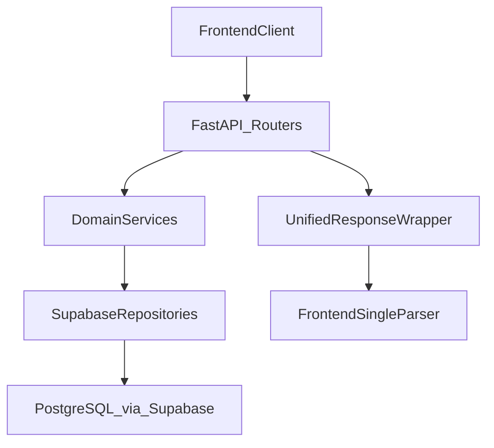
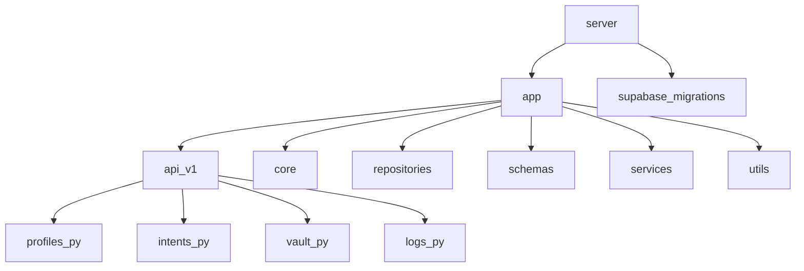

# IntPay Backend API

Production-grade backend for intent-based payments, virtual card controls, and auditable authorization decisions.  
This README is the contract and onboarding guide for backend and frontend developers integrating with IntPay.

## Tech Stack

| Layer | Technology |
|---|---|
| API Framework | FastAPI |
| Validation & Serialization | Pydantic |
| Data Access | Supabase AsyncClient repository pattern |
| Database | PostgreSQL (via Supabase) |
| Payments | Stripe Issuing (plus mock provider mode) |
| Runtime | Python 3.13+ |
| ASGI Server | Uvicorn |

## Getting Started

### 1) Prerequisites

- Python `3.13+`
- `pip`
- Git
- Supabase project credentials
- Stripe credentials (or mock mode enabled)

### 2) Clone and enter the server directory

```bash
git clone <your-repo-url>
cd IntPayApp/server
```

### 3) Create a virtual environment

```bash
python -m venv venv
```

### 4) Activate the virtual environment

Windows (PowerShell):

```powershell
venv\Scripts\Activate.ps1
```

macOS/Linux:

```bash
source venv/bin/activate
```

### 5) Install dependencies

```bash
pip install -r requirements.txt
```

### 6) Configure environment variables

Create `.env` from `.env.example` and set real values:

```bash
cp .env.example .env
```

Required keys (from `.env.example`):

```env
APP_NAME=IntPay API
APP_ENV=development
APP_DEBUG=true
API_V1_PREFIX=/api/v1
SUPABASE_URL=https://your-project.supabase.co
SUPABASE_SERVICE_ROLE_KEY=your_supabase_service_role_key
STRIPE_API_KEY=sk_test_xxx
STRIPE_WEBHOOK_SECRET=whsec_xxx
STRIPE_ISSUING_CARDHOLDER_ID=ich_xxx
USE_MOCK_STRIPE=true
MOCK_STRIPE_STORE_PATH=.mock/mock_stripe_cards.json
GROQ_API_KEY=gsk_xxx
GROQ_MODEL=llama-3.3-70b-versatile
```

### 7) Run database migrations

Apply migrations in order:

1. `supabase/migrations/001_init_intpay.sql`
2. `supabase/migrations/002_intent_category_and_atomic_create.sql`

### 8) Run the API server

```bash
python -m uvicorn app.main:app --reload --port 5000
```

Base API prefix is configured by `API_V1_PREFIX` (default: `/api/v1`).

## API Contract: Unified Response Wrapper

All API responses (success and error) follow this structure:

```json
{
  "success": true,
  "message": "Operation completed successfully",
  "data": {},
  "error": null,
  "meta": {
    "timestamp": "2026-04-28T19:30:00+00:00",
    "version": "v1"
  }
}
```

Error example:

```json
{
  "success": false,
  "message": "Profile not found",
  "data": null,
  "error": {
    "code": "http_404",
    "details": null
  },
  "meta": {
    "timestamp": "2026-04-28T19:30:00+00:00",
    "version": "v1"
  }
}
```

## API Reference (Core Endpoints)

| Domain | Method | Endpoint | Description |
|---|---|---|---|
| Profiles | `GET` | `/api/v1/profiles/{id}` | Fetch a profile by integer ID |
| Intents | `GET` | `/api/v1/intents/{id}` | Fetch an intent by ID with derived `mccList` |
| Vault | `POST` | `/api/v1/vault/add-funds` | Add funds to profile vault balance |
| Audit Logs | `GET` | `/api/v1/logs/{id}` | Fetch a single audit-log record by ID (history item) |

## Endpoint Examples

### Profiles: Get by ID

`GET /api/v1/profiles/{id}`

Success response:

```json
{
  "success": true,
  "message": "Profile retrieved successfully",
  "data": {
    "id": 3,
    "name": "Alice Smith",
    "username": "alice",
    "email": "alice@example.com",
    "vaultBalance": 1500.75,
    "lockMoney": 120.25,
    "stripeCustomerId": "cus_abc123",
    "createdAt": "2026-04-15T10:00:00+00:00"
  },
  "error": null,
  "meta": {
    "timestamp": "2026-04-28T19:30:00+00:00",
    "version": "v1"
  }
}
```

Not found response:

```json
{
  "success": false,
  "message": "Profile not found",
  "data": null,
  "error": {
    "code": "http_404",
    "details": null
  },
  "meta": {
    "timestamp": "2026-04-28T19:30:00+00:00",
    "version": "v1"
  }
}
```

### Intents: Get by ID

`GET /api/v1/intents/{id}`

Success response:

```json
{
  "success": true,
  "message": "Intent retrieved successfully",
  "data": {
    "id": 21,
    "creatorId": 3,
    "receiverId": 7,
    "amount": 150.0,
    "remainingAmount": 120.0,
    "useTimes": 3,
    "usesLeft": 2,
    "category": "tech",
    "mccList": [4816, 5732, 5734, 7372],
    "expiryAt": "2026-12-31T23:59:59+00:00",
    "country": "SA",
    "city": "Riyadh",
    "lockForWebsites": false,
    "onlyWebsites": ["amazon.com", "noon.com"],
    "requiredProve": false,
    "description": "Office supplies budget",
    "status": "active",
    "createdAt": "2026-04-20T11:30:00+00:00"
  },
  "error": null,
  "meta": {
    "timestamp": "2026-04-28T19:30:00+00:00",
    "version": "v1"
  }
}
```

### Vault: Add Funds

`POST /api/v1/vault/add-funds`

Request payload:

```json
{
  "profile_id": 3,
  "amount": 250.0
}
```

Success response:

```json
{
  "success": true,
  "message": "Funds added successfully",
  "data": {
    "profile_id": 3,
    "vault_balance": 1750.75
  },
  "error": null,
  "meta": {
    "timestamp": "2026-04-28T19:30:00+00:00",
    "version": "v1"
  }
}
```

Validation error response (negative amount):

```json
{
  "success": false,
  "message": "Amount must be greater than zero",
  "data": null,
  "error": {
    "code": "http_422",
    "details": [
      {
        "field": "body.amount",
        "message": "Amount must be greater than zero",
        "type": "value_error"
      }
    ]
  },
  "meta": {
    "timestamp": "2026-04-28T19:30:00+00:00",
    "version": "v1"
  }
}
```

### Audit Logs: History Record by ID

`GET /api/v1/logs/{id}`

Success response:

```json
{
  "success": true,
  "message": "Audit log retrieved successfully",
  "data": {
    "id": 44,
    "cardId": 14,
    "transactionAmount": 35.5,
    "merchantName": "bestbuy.com",
    "mcc": "5732",
    "city": "Online",
    "country": "SA",
    "decision": "approved",
    "reason": null,
    "createdAt": "2026-04-28T16:22:00+00:00"
  },
  "error": null,
  "meta": {
    "timestamp": "2026-04-28T19:30:00+00:00",
    "version": "v1"
  }
}
```

## Technical Architecture

### Repository-Centric Backend Design

IntPay uses a layered architecture:

- FastAPI routers expose API endpoints.
- Services orchestrate payment and rule logic.
- Repositories communicate with Supabase/PostgreSQL.
- Global exception handlers normalize all error responses.



### Project Structure Overview



### Validation Logic

- `POST /api/v1/vault/add-funds` enforces:
  - `profile_id` must be a positive integer.
  - `amount` must be greater than zero.
- Intent creation and simulation enforce positive amount and constrained request types through Pydantic schemas.
- Validation errors are transformed into the unified `http_422` error structure with field-level details.

### Category and MCC Behavior

For intents with a category, MCC authorization follows the service mapping:

- `food`: `5812, 5814, 5411, 5499`
- `travel`: `4112, 4511, 4722, 7512, 7011`
- `tech`: `5732, 5734, 4816, 7372`
- `entertainment`: `7832, 7922, 7997`

If the MCC does not match the allowed set, authorization is declined and logged with a reason.

### Unified Response Internals

- Success responses are created through `send_response(...)`.
- Errors are wrapped globally in `register_exception_handlers(...)` for:
  - application errors (`AppError` hierarchy),
  - request validation errors (`RequestValidationError`),
  - HTTP errors and unhandled server exceptions.

## Interactive API Documentation

- Swagger UI: [http://127.0.0.1:5000/docs](http://127.0.0.1:5000/docs)
- ReDoc: [http://127.0.0.1:5000/redoc](http://127.0.0.1:5000/redoc)

## Developer Notes

- Keep integer IDs for profile/intent/card/log flows.
- Preserve request and response field names exactly to avoid frontend contract breaks.
- Use the unified response envelope for any new endpoint to maintain a single frontend parsing strategy.
