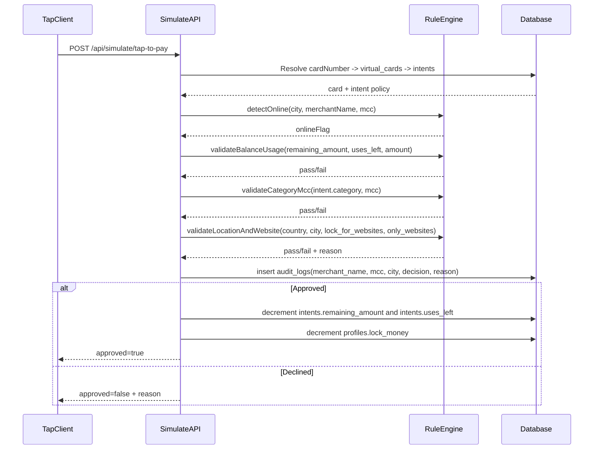
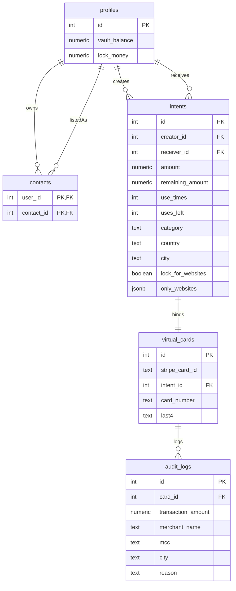

# IntPay System Docs

## 1) Architecture Summary

IntPay uses integer (`serial`) identifiers across all core entities and applies programmable transaction controls through the `intents` table.

The tap-to-pay engine evaluates requests in ordered stages:
1. Detect online context from input signals.
2. Validate financial counters (`remaining_amount`, `uses_left`).
3. Validate category-to-MCC compatibility.
4. Apply website and geo constraints.
5. Write `audit_logs` for every attempt.
6. On approval, settle by decrementing `remaining_amount`, `uses_left`, and creator `lock_money`.

Money fields are handled as `numeric(12,2)` in database operations.

## 2) Category-to-MCC Mapping Reference

| Category | MCC List | Business Meaning |
|---|---|---|
| Food | `5812`, `5814`, `5411`, `5499` | Restaurants, fast food, grocery-like merchants |
| Travel | `4112`, `4511`, `4722`, `7512`, `7011` | Transport, airlines, travel agencies, car rental, hotels |
| Tech | `5732`, `5734`, `4816`, `7372` | Electronics, software, digital/cloud services |
| Entertainment | `7832`, `7922`, `7997` | Cinemas, theaters/events, leisure/club activity |

Validation rule:
- If `intents.category` is set, the input transaction `mcc` must exist in that category list.
- If not matched, transaction is declined and logged with reason:
  - `MCC [code] not allowed for category [category]`

## 3) Sequence Diagram (Tap-to-Pay Flow)

## 4) ER Diagram (Integer IDs + category)

## 5) Atomic Create-Intent Transaction Note

`POST /api/intents/create` is executed through a Postgres RPC function to guarantee all-or-nothing behavior:
- Check `vault_balance >= amount + 0.05`
- Deduct `amount + 0.05` from `vault_balance`
- Add `amount` to `lock_money`
- Insert `intents` record (including `category`)
- Insert linked `virtual_cards` record

If any step fails, the transaction is rolled back by PostgreSQL.
